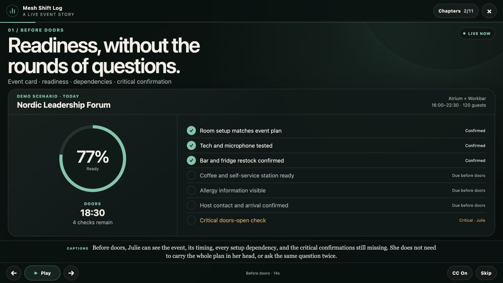
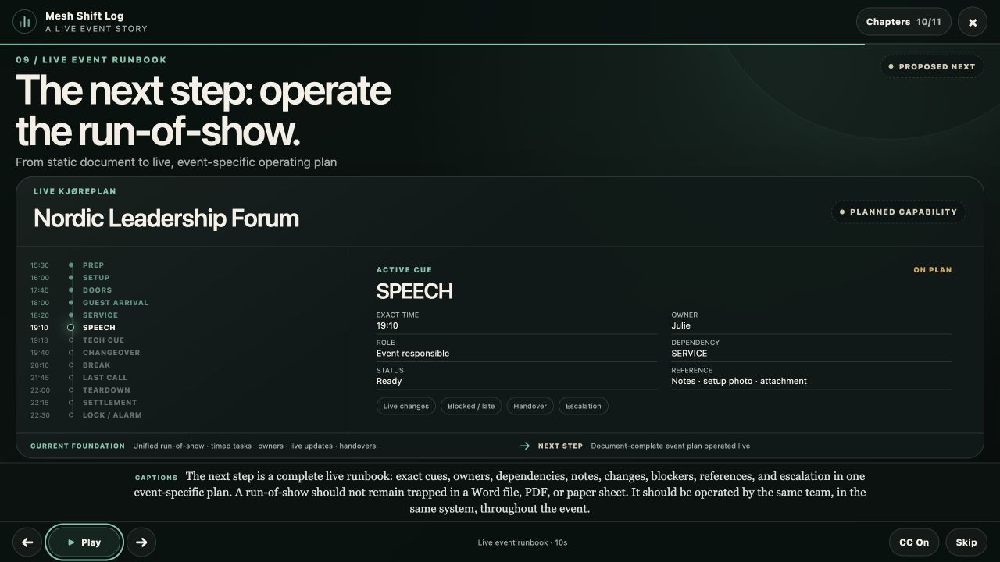
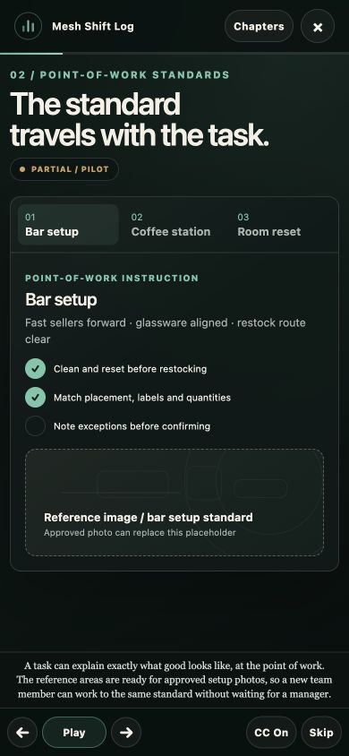

# Event Floor Manager demo capability map

This map is the honesty gate for the Julie / Event Floor Manager cinematic demo. It was prepared from the current repository and README before implementation.

The demo uses deterministic in-memory state. It does not read or write live event, checklist, alert, sign-off, responsibility, asset, handover or manager records.

## Classification

| Demonstrated capability | Classification | Current evidence and boundary |
| --- | --- | --- |
| Event cards, readiness and event task states | **LIVE NOW** | `EventFloorDashboard`, `EventOperationsCorePanel`, `EventOperationsCockpit` and `eventReadinessRules.js` implement the current views and state evaluation. |
| Pre-event, during-event and closeout checks | **LIVE NOW** | The current Event Floor Manager dashboard contains all three task groups; authenticated event tasks add due time, priority, owner and status. |
| Rich task instructions | **LIVE NOW** | Routine tasks and event operation tasks support descriptions, comments, priorities, time and guide links. |
| Approved visual-standard photos | **PARTIAL / PILOT** | `eventRigGuides.js` defines guide/reference structures, but its current image-reference arrays are empty. The demo therefore uses clearly labelled placeholders rather than fictional photos. |
| Overall shift, event, closing, cash/invoice, locking/alarm and asset responsibility | **LIVE NOW** | The current responsibility model and README explicitly separate these roles. Advanced event operations also support command and zone role assignments. |
| Live progress, event issues, changes, acknowledgement and resolution | **PARTIAL / PILOT** | Event tasks, `eventLiveUpdatesClient.js`, cockpit views and Realtime subscriptions exist. They require configured Supabase Auth/backend state for shared operation. |
| Handover information | **LIVE NOW** | Checklist handovers and event responsibility handovers exist. Backend durability depends on authenticated versus local fallback mode. |
| Cash/invoice checks, settlement owner and sign-off | **LIVE NOW** | Current cash/invoice UI and `financialDataClient.js` support local-first records plus Supabase sync for authenticated users. |
| Payment terminal and POS/iPad registry/checks | **PARTIAL / PILOT** | `assetDataClient.js` supports registry and check records including presence, location, condition, charging and serial. Authenticated sync exists, while staff-code use and rollout still include fallback/pilot constraints. |
| Event closeout and completion | **LIVE NOW** | Current closeout task groups and cockpit completion state support an explicit event finish. |
| Management progress, missing/critical work, alerts, sign-offs and history | **PARTIAL / PILOT** | Current manager dashboards, backend history and event cockpit expose these signals. Older local modules are not yet completely unified in backend history. |
| Unified event run-of-show foundation | **LIVE NOW** | `eventOperationsTimeline.js` combines boundaries, run-sheet segments, tasks, staffing, handovers, live updates and operational time overrides. |
| Document-complete live event runbook / kjøreplan | **PROPOSED NEXT** | The demo’s final timeline vision adds complete dependencies, attachments/setup photos, blocked/late semantics and escalation as a designed next step. It is explicitly labelled `PLANNED CAPABILITY`. |
| Google Calendar import and event linking | **PARTIAL / PILOT** | `calendarImportClient.js` implements authenticated source management, import, sync and linking. It depends on Supabase functions and provider configuration. The README’s older “no calendar integration” statement is no longer a complete description of the current code. |
| Browser task alerts | **PARTIAL / PILOT** | Current event-task alert state can use browser notification permission. Behavior depends on the active browser/device and permission. |
| Production push notifications | **PROPOSED NEXT** | The README correctly states that there is no full push-notification service. Urgent email and browser task-alert paths must not be presented as complete production push. |
| Authentication and security | **PARTIAL / PILOT** | Supabase email/password is the intended backend route. Staff-code login remains a local fallback and is not real authentication; organization and policy rollout must be verified before production claims. |

## Demo-only visual behavior

The following state changes are illustrative and isolated: readiness rising, a technical exception being acknowledged/resolved, a wrong-location iPad being assigned for correction, settlement sign-off, closeout completion, management metrics and runbook cue movement.

They demonstrate how current capabilities or a clearly marked proposed capability behave. They are not loaded from production data and are never saved.

## Data-isolation contract

- No Supabase or storage client is imported by the cinematic tour components.
- No live app record is passed into the tour.
- Playback state is held in component memory and disappears on exit.
- Start, pause, chapter navigation, skip, replay and exit are presentation actions only.
- Returning to Event Floor Manager reveals the same live app state that existed before the tour opened.

## Review screenshots

### Event readiness — 1280 × 720

### Planned live runbook — 1280 × 720

### Point-of-work standards — 390 × 844

